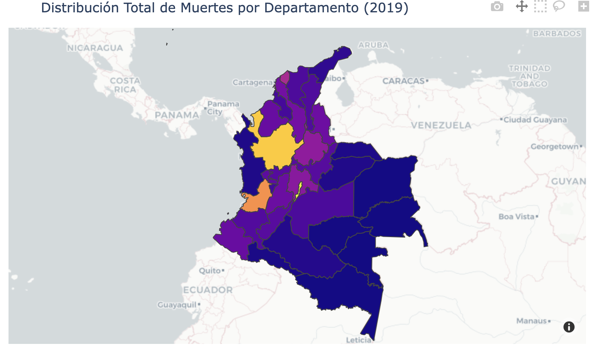
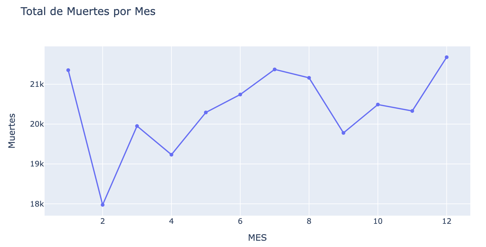
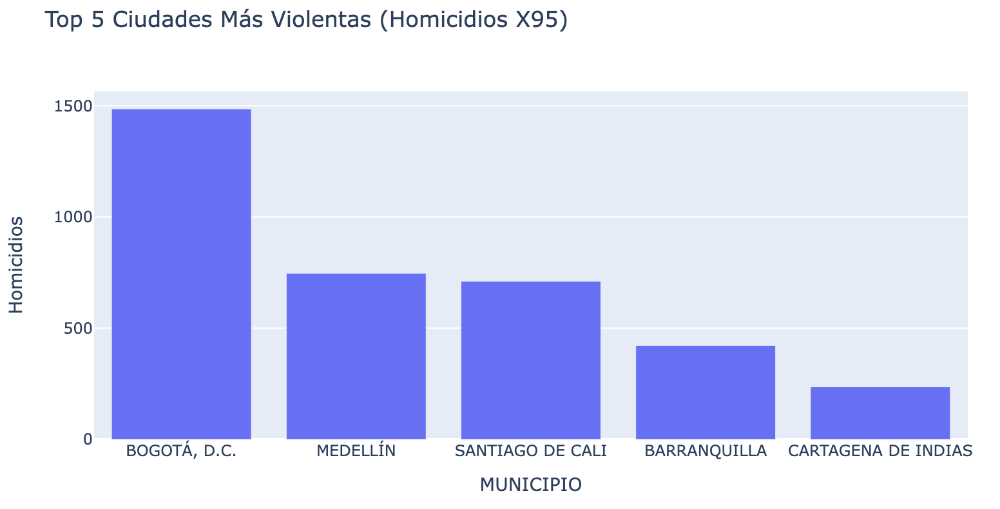
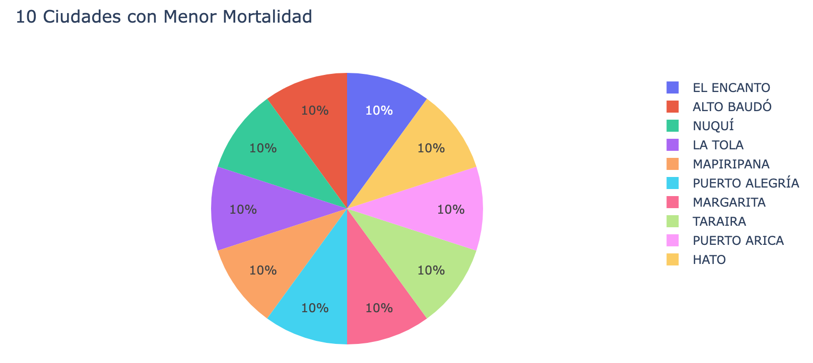
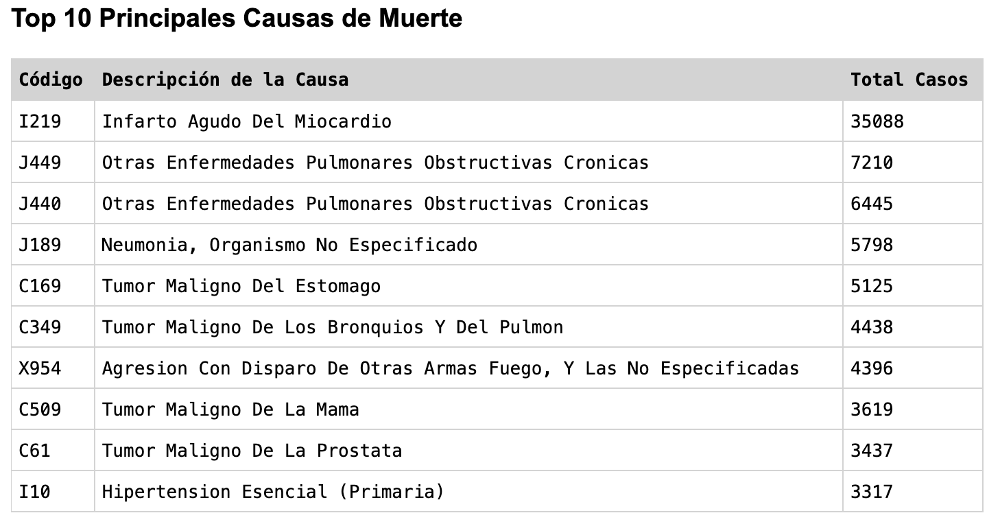
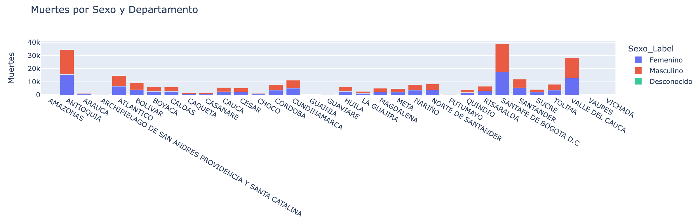
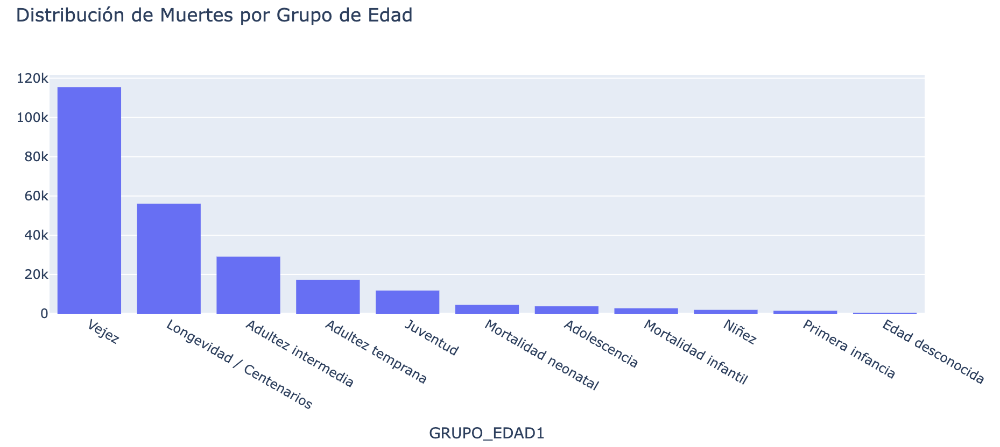

# Análisis de Mortalidad en Colombia (2019)

**Nombre completo de los integrantes del grupo:** Johnathan Morales Vargas

**URL de la aplicación web en Render:** https://mortalidad-colombia2019.onrender.com

**URL en GitHub:** https://github.com/johnathanMorales/mortalidad-Colombia2019.git


## Introducción del proyecto
Esta aplicación web interactiva es un proyecto académico diseñado para el análisis de los datos de mortalidad en Colombia correspondientes al año 2019. Utilizando tecnologías modernas de análisis de datos y visualización interactiva, la aplicación transforma un gran volumen de registros complejos en gráficas y mapas accesibles e intuitivos, facilitando la comprensión de tendencias demográficas y geográficas a lo largo del país.

## Objetivo
El objetivo principal de la aplicación es proveer una herramienta visual y dinámica para:
- Identificar y analizar la distribución de muertes a lo largo del territorio nacional.
- Explorar patrones temporales (mensuales) y demográficos (edad, sexo).
- Resaltar las ciudades más violentas y aquellas con menor índice de mortalidad.
- Exponer de manera clara las principales causas de muerte registradas durante el año 2019.

## Estructura del proyecto
La estructura principal del repositorio es la siguiente:
- `app.py`: Archivo principal que contiene la lógica de la aplicación web, el procesamiento de datos utilizando Pandas y la estructura visual de la interfaz empleando Dash y Plotly.
- `data/`: Directorio que almacena los datos e información geoespacial.
  - `datos.csv`: Conjunto de datos principal con los registros de mortalidad (depurado para normalizar nombres de departamentos sin tildes).
  - `Colombia.geo.json`: Archivo geoespacial con los polígonos de los departamentos de Colombia, requerido para el mapeo interactivo en Plotly.
- `requirements.txt`: Listado de librerías y dependencias estrictas necesarias para ejecutar el proyecto.
- `.python-version`: Archivo de configuración que especifica la versión exacta de Python a usar durante el despliegue.

## Requisitos
Para garantizar el correcto funcionamiento del proyecto tanto localmente como en producción, se utilizan las siguientes versiones fijadas de las librerías:
- **Dash**: `2.14.2`
- **Pandas**: `2.1.4`
- **Plotly**: `5.18.0`
- **Gunicorn**: `26.0.0` (Servidor para despliegue en producción)
- **Geojson**: `3.1.0`

## Despliegue en Render
El proyecto está optimizado para ser publicado en la plataforma de alojamiento en la nube [Render](https://render.com/). 

Durante el proceso de despliegue, fue necesario realizar los siguientes ajustes fundamentales para lograr compatibilidad y éxito en la construcción de la aplicación:
1. **Fijar la versión de Pandas:** Fue crucial limitar la versión en el `requirements.txt` a `pandas==2.1.4`. El intentar utilizar la versión más reciente (Pandas 3.0+) generaba un error (`KeyError`) por incompatibilidad interna en el manejo de agrupaciones (`groupby`) cuando Plotly Express intentaba renderizar las gráficas divididas por colores.
2. **Asignación del Servidor WSGI (Gunicorn):** Se incorporó la variable `server = app.server` en el código principal (`app.py`) y se instaló `gunicorn` para establecer una comunicación adecuada y estable como servidor web en producción.
3. **Versión de Python:** Se creó un archivo llamado `.python-version` que indica explícitamente el uso de Python `3.11.9`. Render estaba intentando por defecto instalar dependencias en Python 3.14 (una versión experimental sin binarios precompilados para Pandas), lo que provocaba una falla en la compilación desde el código C/Cython. Limitar el entorno a Python 3.11 aseguró que los binarios se instalaran rápidamente.
4. **Limpieza de Datos Geográficos:** Para que el mapa de calor (Choropleth) funcionara, se tuvo que procesar el CSV base (`datos.csv`) para eliminar las tildes de todos los departamentos (ej. `ATLÁNTICO` a `ATLANTICO`) e igualar `BOGOTÁ, D.C.` a `SANTAFE DE BOGOTA D.C`. Esto garantizó el emparejamiento perfecto con las llaves (`properties.NOMBRE_DPT`) del archivo `Colombia.geo.json`.

## Software
Las herramientas principales que conforman el ecosistema tecnológico de este proyecto son:
- **Python**: Lenguaje de programación base.
- **Dash**: Framework para construir y desplegar aplicaciones web analíticas.
- **Plotly Express**: Herramienta avanzada para la creación de las visualizaciones interactivas.
- **Pandas**: Librería estrella para manipulación, estructuración y análisis de datos tabulares.
- **Git / GitHub**: Sistema de control de versiones y alojamiento remoto de código.
- **Render**: Plataforma PaaS (Platform as a Service) para despliegue y alojamiento en la nube.

## Instalación
Para clonar este repositorio y ejecutar la aplicación en tu máquina local, abre tu terminal y sigue estas instrucciones paso a paso:

1. **Clona el repositorio**
   ```bash
   git clone https://github.com/johnathanMorales/mortalidad-Colombia2019.git
   cd mortalidad-Colombia2019
   ```

2. **Crea y activa un entorno virtual (Muy Recomendado)**
   - En macOS / Linux:
     ```bash
     python3 -m venv venv
     source venv/bin/activate
     ```
   - En Windows:
     ```cmd
     python -m venv venv
     venv\Scripts\activate
     ```

3. **Instala las dependencias**
   ```bash
   pip install -r requirements.txt
   ```

4. **Ejecuta la aplicación**
   ```bash
   python app.py
   ```
   
La terminal te confirmará que Dash se está ejecutando. Abre tu navegador web e ingresa a `http://127.0.0.1:8050/` para explorar el tablero interactivo localmente.

## Visualizaciones



Mapa de calor de mortalidad en Colombia en 2019. Se puede observar la concentración de muertes en los departamentos de Antioquia y Bogotá.



Distribución mensual de muertes en Colombia en 2019. Se puede observar que los meses con mayor mortalidad fueron enero, julio y diciembre.



Visualización de las 5 ciudades más violentas de Colombia, considerando homicidios (códigos X95, agresión con disparo de armas de fuego y casos no especificados).



Ciudades con menor mortalidad, donde toda tienen 1 muerte registrada.



Principales causas de muerte en Colombia en 2019, se puede observar que la principal causa de muerte es Infarto Agudo Del Miocardio.



Muertes por sexo y departamento, se puede observar que la distribución de muertes por sexo es similar en todos los departamentos, con una ligera predominancia de muertes en hombres.  



Distribución de muertes por grupo de edad en Colombia en 2019, se puede observar que la mayor concentración de muertes se encuentra en el grupo de vejez. y que ningún grupo es menor en muertes a su anterior grupo. Es decir a mayor edad, más muertes hay.